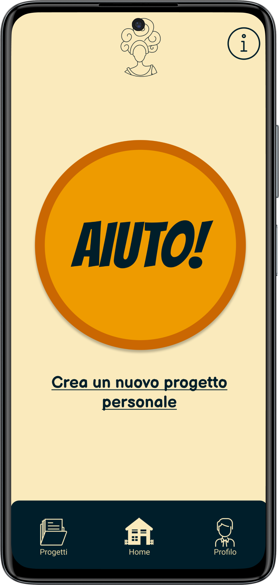
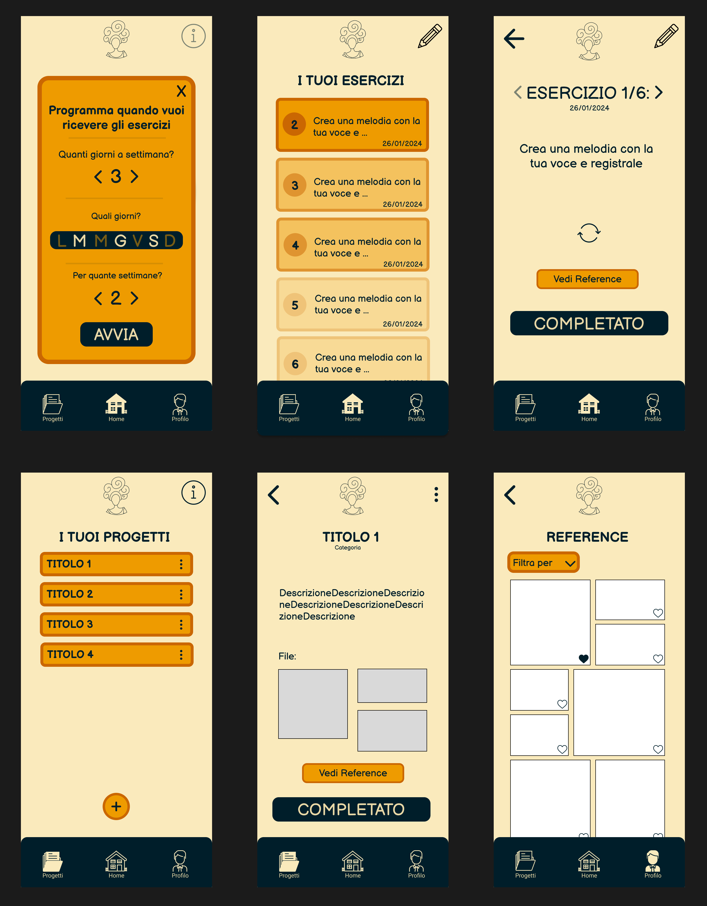
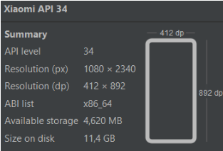

# 🎨 Musa - A tool to keep your creative process alive

**Musa** is a mobile application designed for artists, musicians, and creatives facing the dreaded "writer's block" or creative block. The challenge of maintaining a steady creative flow affects both professionals and hobbyists, often leading to scattered ideas and frustration.

Our solution acts as a digital companion, providing the user with targeted inputs and simple daily activities designed to overcome these moments of standstill. Heavily inspired by the philosophy of Rick Rubin's *The Creative Act: A Way of Being*, Musa aims to stimulate the mind without forcing rigid routines.

Through the app, users can generate personalized exercise plans, organize their personal projects, and keep track of their visual and conceptual references in a single, dedicated space. This prevents the common issue of losing valuable inspiration scattered across different social media or disorganized phone notes. The ultimate goal is to offer a supportive environment that allows creatives to keep their spark alive and seamlessly resume their work.

 

---

## 🔍 Overview and Exploration

Click on the sections below to discover the details of the design process, technical development, and practical info to test the app.

<b>🛠️ 1. UX & UI Design Process</b>

 

The app's design is heavily *user-centered*, based on needfinding and interviews.

* **Target:** We analyzed the domain by dividing users into Immediate users (creatives for passion/study), Lead users (industry professionals), Extreme users (e.g., producers), and Domain experts (teachers).
* **Needfinding:** From the emerged needs, we focused on the necessity to maintain creative stimulation and to keep track of references in a single place.
* **UX Solution:** We opted to propose useful exercises to the user, supported by material (references) in order to constantly inspire them.
* **Prototyping:** We moved from low-fidelity paper prototypes, tested through heuristic evaluation, up to high-fidelity.
* **High Fidelity (Figma):** We defined the UI, palette, and interactive flows divided into key sections such as Login, Homepage, Task, Profile, Projects, and References.

*(Overview of the Figma workspace with the various interaction flows)*

<b>💻 2. Tech Stack and Development</b>

 

The high-fidelity prototype was developed natively for Android.

* **Frontend:** `Jetpack Compose` (native UI toolkit) using `Material Design 3` components.
* **Backend & Logic:** `Kotlin`.
* **Database & Storage:** `Firebase` (Realtime Database for exercise data and Storage for reference images).
* **Limitations:** The application does not contain real authentication management and therefore does not allow its use on multiple devices simultaneously.

<b>📱 3. Main Features (Tasks)</b>

 

The application was built around three main tasks identified during the research:

1. **Planning (Simple Task):** Plan an exercise schedule to overcome creative block.
2. **Consultation (Moderate Task):** Consult restricted and targeted references for the personal project you are working on.
3. **Customization (Complex Task):** Customize the duration of the exercise plan, requesting a higher or lower number of tasks.

  
   
  <i>(Overview of Musa's core workflows: personalized exercise planning, daily task execution, and targeted reference consultation)</i>

<b>🚀 4. Practical Info and Testing</b>

 

In order to correctly view the prototype, make sure to set the following specifications for the virtual device dimensions within Android Studio:

* **Base Model:** Xiaomi API 34
* **Resolution (px):** 1080 x 2340
* **Resolution (dp):** 412 x 892

**First launch behavior:**
The first time the application is installed on the virtual phone (or on a real device connected in debug mode), the app will start on the initial form to allow the user to complete the entire path.

**Resetting the path:**
* To start from scratch, uninstall and reinstall the app.
* Alternatively, delete the account from the profile section (note: this returns to the initial form, but will skip the tutorial).

 

 

> 📄 **Want to dive deeper?** Read the full [Project Report (PDF) 🇮🇹](docs/Musa_Report.pdf) for all the details.

---

*Project created for the User Experience Design course (A.Y. 2023/24) at Politecnico di Torino.*

*Credits: Federica Cuomo, Andrea De Luca, Francesca Porro, Giorgio Spegis.*
